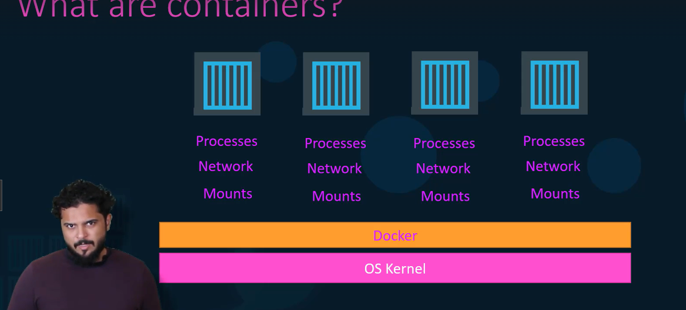
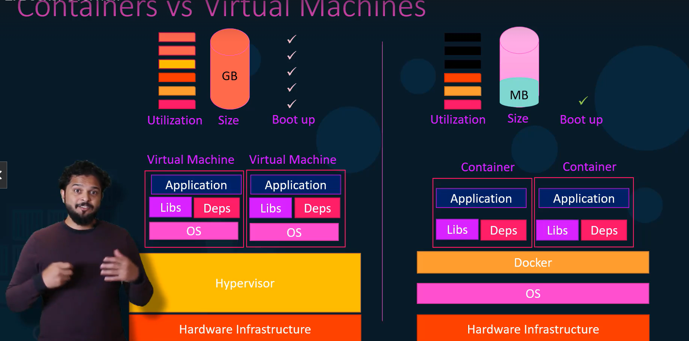
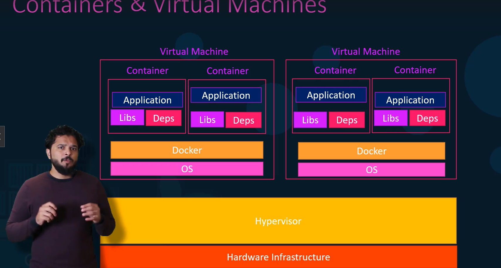

 Containers are low level ,and hard to setup that is why we docker to give a high level overview of docker
 Difference between VMs and Dockers
 a blend of of Vms and dockers are used for large scale applications
